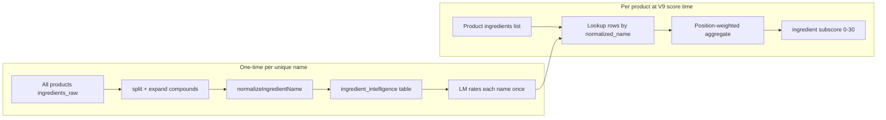

# Site improvements plan (parallel to LM overnight jobs)

While `ocr:lm` and `rate:ingredients` run, improve the **live site** and **data plumbing** without blocking on V9 cutover.

Related: [plan.md](./plan.md) (scoring V9), [§9 LM operations](./plan.md#9-lm-studio-operations-local).

---

## How ingredient rating works (today)

**Yes — ingredients are rated once, globally, and reused everywhere.**



| Step | What happens |
|------|----------------|
| **Collect** | Scan every `products.ingredients_raw` → `uniqueIngredientsFromList()` (split commas/`;`, expand `seasoning (…)`, aliases, strip `; an …`). |
| **Dedupe** | ~23k unique normalized names across catalog (not 23k LM calls per product). |
| **Rate** | `pnpm rate:ingredients` batches names to Qwen → one row per name in `ingredient_intelligence`. |
| **Reuse** | Any product containing `milk solids` uses the same cached row. |
| **Aggregate** | V9 scoring loads rows in list order, weights `exp(-i/3)`, blends `intrinsic_quality` + concern tiers → 0–30 ingredient subscore. |
| **Fallback** | Names not yet rated → `scoreAdditives()` regex rules (`ingredient-rules.json`). |

**Not on the site yet**

- Live scores are still **V8** (`SCORING_ENGINE=v8` default).
- PDP ingredient panel uses **regex rules**, not `ingredient_intelligence`.
- Verdict chips are **inferred** from V8 score until V9 rescore + persist.

**After overnight**

1. `pnpm backfill:per-serve`
2. `pnpm score:v9:diff -- --limit=500`
3. `SCORING_ENGINE=v9 pnpm score -- --force`
4. Wire ingredient panel to intelligence table (Phase B below).

---

## Priority tracks (while LM runs)

### Track A — Data quality (mostly automated)

| Task | Owner | Status |
|------|--------|--------|
| OCR+LM 2k resume (`format` + lock) | script | in progress |
| `rate:ingredients --all` | script | in progress |
| `pnpm backfill:per-serve` after OCR stabilizes | script | pending |
| `pnpm ocr:lm:backfill-db` if JSONL ahead of DB | script | as needed |
| Grow `ALIAS_MAP` from `--debug` skips | manual + PR | ongoing |

**Exit:** Label-resolved products show formatted ingredients; OCR payload `compare` mostly `match` or intentional `different`.

---

### Track B — PDP & catalog UX (no V9 required)

High impact, can ship incrementally.

| # | Improvement | Why | Effort |
|---|-------------|-----|--------|
| B1 | **Ingredient panel → intelligence** | Show NOVA, concern tier, `concern_reasons` from DB; fallback to regex for unrated names | M |
| B2 | **Label change summary** polish | Already exists; add “sources” tooltip (CSV vs LM vs OCR) | S |
| B3 | **Verdict on cards** | Done; ensure contrast in dark mode | S |
| B4 | **Per-serving nutrition default** | Done (`NutritionTable`); run `backfill:per-serve` so column has data | S + script |
| B5 | **Three score dials** | Nutrition / ingredient / labels breakdown on PDP (V8 subscores OK until V9) | M |
| B6 | **“Better than X%” cohort line** | Needs V9 `relative_score` + `cohort_size`; hide until rescore | S (after V9) |
| B7 | **Filter: Label ≠ CSV** | Exists; document in UI helper text | S |
| B8 | **Empty states** | “Score pending”, “Ingredients not on label”, “OCR in progress” | S |

---

### Track C — Catalog & performance

| # | Improvement | Why | Effort |
|---|-------------|-----|--------|
| C1 | **Sort by verdict** (after V9) | User mental model matches chips | M |
| C2 | **Cache catalog API** | `catalog-cache.ts` — verify TTL + invalidation on score version | S |
| C3 | **Goal mode perf** | Router.replace for goals (done); audit swap pool size | S |
| C4 | **Adjunct labeling** | Badge “Pantry staple / seasoning” so tea≠yogurt confusion | S |
| C5 | **Category filter fixes** | Fruits & veg CSV name alignment (done); audit other taxonomies | M |

---

### Track D — Scoring cutover (after data jobs)

| # | Step | Command |
|---|------|---------|
| D1 | Diff V8 vs V9 | `pnpm score:v9:diff -- --limit=500` |
| D2 | Tune blend 55/45 if needed | edit `core-v9.ts` |
| D3 | Cutover | `SCORING_ENGINE=v9 SCORING_RULE_VERSION=9 pnpm score -- --force` |
| D4 | Purge stale V8 rows | automatic via `rule_version` |
| D5 | Re-run goal rows / basket | existing goal scripts |

---

### Track E — Goals & basket (Phase 4)

| # | Improvement | Depends on |
|---|-------------|------------|
| E1 | Goal fit uses `per_serve_*` + intelligence | V9 + rated ingredients |
| E2 | Goal-contextualized sublabels | E1 + schema |
| E3 | Basket verdict summary | V9 verdict on line items |
| E4 | Swap explanations cite sublabels | E2 |

---

### Track F — Insights & trust

| # | Improvement | Effort |
|---|-------------|--------|
| F1 | Insights page: top brands by avg score | S |
| F2 | Data provenance panel: link to OCR image when present | S |
| F3 | Grade legend ↔ verdict mapping | S |
| F4 | Methodology page (how scores work) | M |

---

## Suggested order (next 2 weeks)

**Week 1 (while LM runs)** — ship B1, B4, B5, B8, C4, F2  
**Week 2 (after rate:ingredients ~complete)** — D1–D3, B1 full coverage, B6, C1  
**Week 3+** — E track, Phase 6 cleanup in plan.md

---

## Quick wins to implement first (recommended)

1. **B1** — Ingredient panel reads `ingredient_intelligence` (rated names get rich row; others keep regex).
2. **B5** — Three dials component using existing `subscores` on PDP.
3. **C4** — `role_cohort` badge on PDP (infer client-side until V9 persist).
4. **F2** — Provenance: show `ocr_image_url` thumbnail when set.

These do not require stopping overnight jobs or V9 cutover.

---

## Monitoring overnight jobs

```bash
pnpm lm:status
tail -f /tmp/oasis-ocr-lm-2k.log
# rate:ingredients if teed:
tail -f /tmp/oasis-rate-ingredients.log
```

**Tip:** Run only one LM-heavy job at a time unless both use restarted code with `studio-lock` (OCR resumed with lock; restart rater to pick up lock + normalize).
